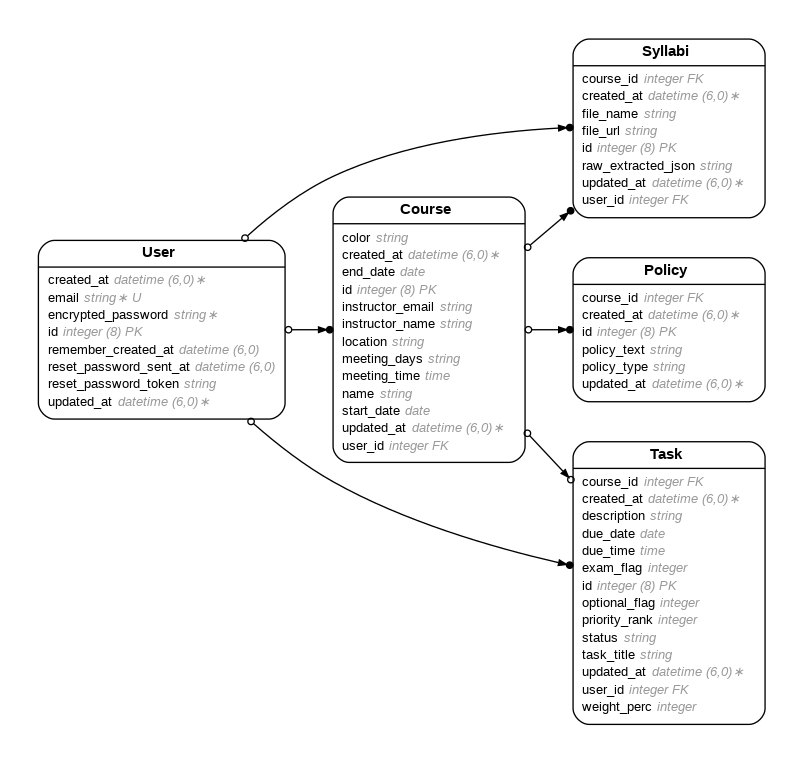

# Homework Tracker: LLM Syllabus Extraction

Homework Tracker turns course syllabi into a personal task list. A student uploads a syllabus PDF, a large language model extracts the course details, policies, assignments, exams, and readings into structured JSON, and the app loads the results into a PostgreSQL database behind a sortable, filterable task dashboard. No manual data entry is needed.


## How it works

1. **Upload.** The user uploads a syllabus PDF from the home page.
2. **Extract.** `SyllabusParser` (`app/services/syllabus_parser.rb`) sends the PDF to the OpenAI Responses API (`gpt-4o-mini`) with a prompt that specifies an exact JSON output shape.
3. **Import.** `SyllabusImporter` (`app/services/syllabus_importer.rb`) creates the course, its policies, and one task per assignment or reading. The raw model output is stored alongside the course for traceability.
4. **Track.** The dashboard lists upcoming tasks, which can be sorted by due date, course, or priority, filtered (for example, exams only), edited, and marked complete.

## Extraction design

The prompt treats the model as a structured-data extractor, with explicit rules aimed at reliability:

- **A fixed output schema.** Course metadata, a `policies` array, and a `tasks` array with typed fields (`due_date` as `YYYY-MM-DD`, `due_time` as `HH:MM`, integer flags for exams and optional work, and assignment weight).
- **No invented values.** Missing or uncertain fields must be `null`. The model is told not to invent dates, times, or weights.
- **Provenance for inferred tasks.** Each task includes `is_inferred`, the exact `source_text` from the syllabus that supports it, and a short `inference_note` explaining any inference. These fields are kept in the stored raw JSON.
- **Count validation.** If the syllabus states an explicit count (for example, "7 reaction papers"), the output must contain exactly that many tasks, and the model is told to check this before returning.
- **Readings as tasks.** Readings assigned by date, week, or session become individual tasks, including those that appear only in schedule tables.
- **Classification rules.** Only actual exams, tests, and quizzes are flagged as exams. Essays and papers are not.

A sample syllabus for testing is included in `test_files/sample_syllabus.pdf`.

## Data model

Users have courses. Each course has tasks, policies, and the syllabus record it came from (including the raw extracted JSON). See `erd.png` for the full entity-relationship diagram.



## Tech stack

- **Backend:** Ruby on Rails 8, PostgreSQL
- **LLM:** OpenAI Responses API (`gpt-4o-mini`) via the `openai` gem
- **Authentication:** Devise
- **Frontend:** Rails views with Hotwire (Turbo and Stimulus)
- **Deployment configuration:** Render (`render.yaml`)

## Running locally

Prerequisites: Ruby 4.0.1 (see `.ruby-version`), PostgreSQL, and an OpenAI API key.

```bash
git clone https://github.com/begumakkas/hw-scheduler.git
cd hw-scheduler
bundle install

# Add your API key
echo "OPENAI_API_KEY=your_key_here" > .env

bin/rails db:setup
bin/dev
```

Then open http://localhost:3000, create an account, and upload a syllabus PDF.

## Project structure

```
app/
  services/
    syllabus_parser.rb     # LLM extraction: prompt, schema, and API call
    syllabus_importer.rb   # Loads extracted JSON into courses, tasks, and policies
  controllers/             # Courses, tasks, policies, syllabi, home dashboard
  models/                  # User, Course, Task, Policy, Syllabi
  views/                   # Dashboard, upload form, and resource pages
test_files/
  sample_syllabus.pdf      # Example input
```


## License

MIT. See [LICENSE.txt](LICENSE.txt).
